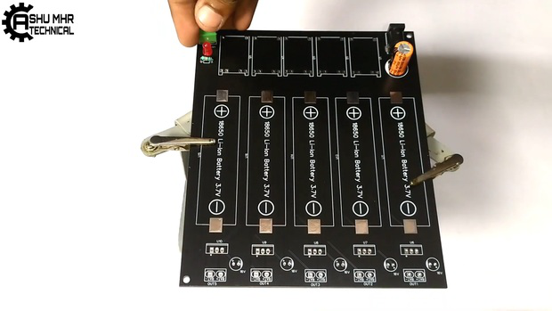
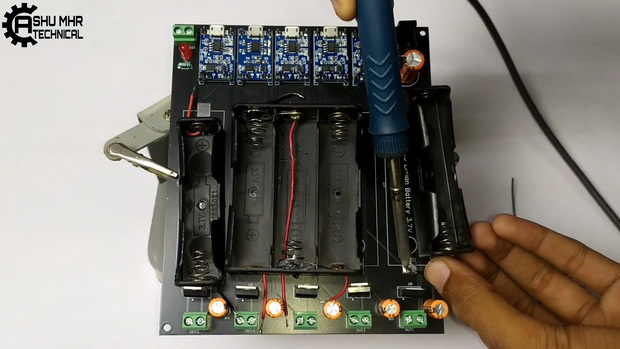

# DIY-18650-Battery-Charging-Station

> **Story**

> It can be frustrating when our electronics die at the most inopportune
> times, but have no fear! In this DIY project, I show you how to build
> a 18650 battery charging station for all of those batteries. You
> won\'t believe what you can get for just a couple bucks.
>
> **Supplies:**
>
>  
>  
Get all the components ready.

 

> **Step 1: Get Your PCB Ready!**

**Talking about electronics.**

 
 

> After making the circuit diagram I transformed it into a PCB design to
> produce it, to produce the PCB, I have chosen he best PCB supplier and
> the cheapest PCB provider to order my circuit. with the
> reliable platform, all I need to do is some simple steps which we will
> talk later.

 
 

> Related Download Files\
> **As you can see in the pictures above the PCB is very well
> manufactured and I've got the same PCB assembled with all the
> components that we want to use for our main board and all the labels
> and logos are there to guide me during the soldering steps. You can
> also download the Gerber  le for this circuit from the download link
> below in case you want to place an order for the same circuit
> design.**

 

 
 

 
 

**Step 2: Place All the Components on PCB and Solder It Properly.**

>  
>  
**Soldering all** the components to **PCB**.

 
 

 
 

 
 

 
 

 
 

 
 

**Step 3: Soldering Battery Holder.**

 

> **Soldering battery holder** to the **PCB**.
>
> **Note: Take care** of **polarities polarities**.

 
 

 
 

 
 

**Step 4: Measuring the Battery Voltage.**

> **Measuring** the **battery voltage battery voltage** before charge
> using **multimeter.**

 
 

 
 

 
 

 
 

**Step 5: Battery Starts Charging.**

> Insert the **Batteries in battery holders.**

 
 

> Power the circuit using adapter.
>
> The **Red Led** will **glow** showing that battery is
> charging.

 
 

 
 

 
 

 
 

 
 

> **Step 6: Battery Is Fully Charged.**

 

> Finally, the DIY 18650 Battery Charging Station charged the batteries
> indicating with **blue light. Verifying** the charged battery by
> measuring the voltage using multimeter.\
> Download Gerber file from [HERE](https://cdn.hackaday.io/files/1878978038985248/gerber%2018650%20charging.zip).

**New users will also get some coupons while registering at [JLCPCB](https://jlcpcb.com/IAT) via this blue
link.**

**Thank you for reading this guide, hopefully**, **this guide provides
full steps to help you to create your own DIY this guide provides full
steps to help you to create your own DIY Charging Station. If you have any questions please post them in the
comment section below.**

 
 

 
 

 
