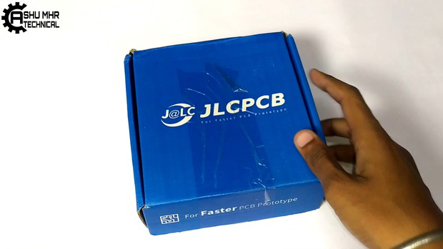
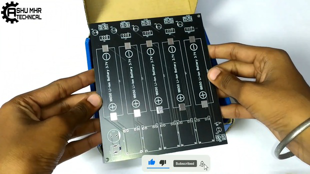
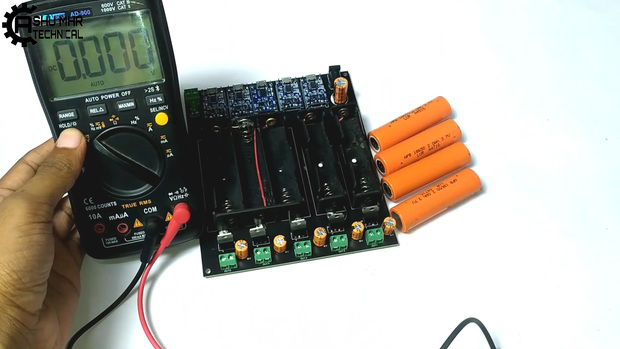
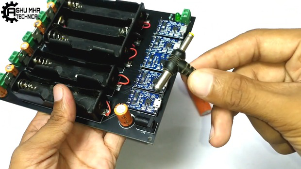
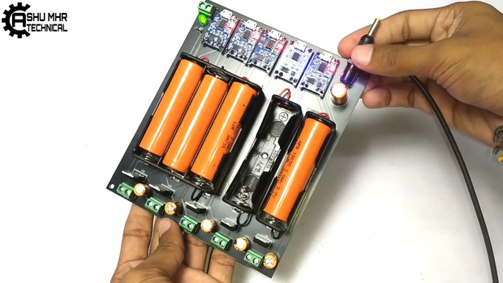
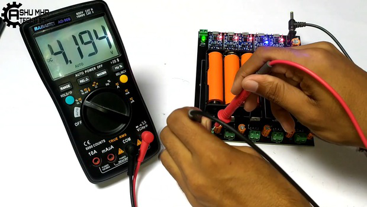
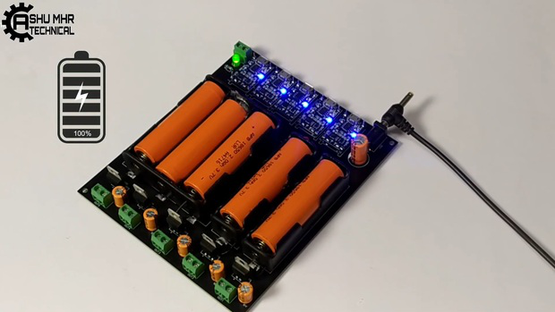
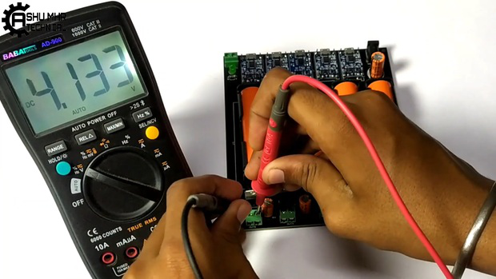

{width="0.5236111111111111in"
height="0.5847211286089239in"}

**instructables**

{width="0.5097222222222222in"
height="0.5097211286089239in"}

> by
>
> It can be frustrating when our electronics die at the most inopportune
> times, but have no fear! In this DIY project, I show you how to build
> a 18650 battery charging station for all of those batteries. You
> won\'t believe what you can get for just a couple bucks.
>
> **Supplies:**
>
> {width="0.1388888888888889in"
> height="0.1388888888888889in"}Get all the components ready.

{width="7.477777777777778in"
height="4.208332239720035in"}

> **Step 1: Get Your PCB Ready!**

**Talking about electronics.**

{width="0.1388888888888889in"
height="0.1527777777777778in"}

> After making the circuit diagram I transformed it into a PCB design to
> produce it, to produce the PCB, I have chosen he best PCB supplier and
> the cheapest PCB provider to order my circuit. with the
>
> reliable platform, all I need to do is some simple steps which we will
> talk later.

DIY 18650 Battery Charging Station: Page 1

{width="0.1388888888888889in"
height="0.1388888888888889in"}

> Related Download Files\
> **As you can see in the pictures above the PCB is very well
> manufactured and I've got the same PCB assembled with all the
> components that we want to use for our main board and all the labels
> and logos are there to guide me during the soldering steps. You can
> also download the Gerber �le for this circuit from the download link
> below in case you want to place an order for the same circuit
> design.**

{width="7.477777777777778in"
height="4.206943350831146in"}

{width="7.477777777777778in"
height="4.208333333333333in"}

DIY 18650 Battery Charging Station: Page 2

{width="7.477777777777778in"
height="4.208333333333333in"}

**Step 2: Place All the Components on PCB and Solder It Properly.**

> {width="0.1388888888888889in"
> height="0.1527777777777778in"}**Soldering all** the components to
> **PCB PCB**.

{width="7.477777777777778in"
height="4.208333333333333in"}

DIY 18650 Battery Charging Station: Page 3

{width="7.477777777777778in"
height="4.208333333333333in"}

{width="7.477777777777778in"
height="4.208333333333333in"}

DIY 18650 Battery Charging Station: Page 4

{width="7.477777777777778in"
height="4.208333333333333in"}

{width="7.477777777777778in"
height="4.208333333333333in"}

DIY 18650 Battery Charging Station: Page 5

{width="7.477777777777778in"
height="4.208333333333333in"}

**Step 3: Soldering Battery Holder.**

{width="0.1388888888888889in"
height="0.375in"}

> **Soldering battery holder** to the **PCB PCB**.
>
> **Note: Take care** of **polarities polarities**.

{width="7.477777777777778in"
height="4.208333333333333in"}

DIY 18650 Battery Charging Station: Page 6

{width="7.477777777777778in"
height="4.208333333333333in"}

{width="7.477777777777778in"
height="4.208333333333333in"}

**Step 4: Measuring the Battery Voltage.**

> **Measuring** the **battery voltage battery voltage** before charge
> using **multimeter.**

DIY 18650 Battery Charging Station: Page 7

{width="7.477777777777778in"
height="4.208333333333333in"}

{width="7.477777777777778in"
height="4.208333333333333in"}

DIY 18650 Battery Charging Station: Page 8

{width="7.477777777777778in"
height="4.208333333333333in"}

{width="7.477777777777778in"
height="4.208333333333333in"}

**Step 5: Battery Starts Charging.**

> Insert the **Batteries in battery holders.**

{width="0.1388888888888889in"
height="0.1388888888888889in"}

> Power the circuit using adapter.
>
> The **Red Led Red Led** will **glow glow** showing that battery is
> charging.

DIY 18650 Battery Charging Station: Page 9

{width="7.477777777777778in"
height="4.208333333333333in"}

{width="7.477777777777778in"
height="4.208333333333333in"}

DIY 18650 Battery Charging Station: Page 10

{width="7.477777777777778in"
height="4.208333333333333in"}

{width="7.477777777777778in"
height="4.208333333333333in"}

DIY 18650 Battery Charging Station: Page 11

{width="7.477777777777778in"
height="4.208333333333333in"}

> **Step 6: Battery Is Fully Charged.**

{width="0.1388888888888889in"
height="0.375in"}

> Finally, the DIY 18650 Battery Charging Station charged the batteries
> indicating with **blue light. Verifying** the charged battery by
> measuring the voltage using multimeter.\
> **DownloadGerber Gerber** �le from

**New users will also get some coupons while registering atvia this blue
link.**

**Thank you for reading this guide, hopefully**, **this guide provides
full steps to help you to create your own DIY this guide provides full
steps to help you to create your own DIY**

**Cycle Tail Lights. If you have any questions please post them in the
comment section below.**

DIY 18650 Battery Charging Station: Page 12

{width="7.477777777777778in"
height="4.208333333333333in"}

{width="7.477777777777778in"
height="4.208333333333333in"}

DIY 18650 Battery Charging Station: Page 13

{width="7.477777777777778in"
height="4.208333333333333in"}

DIY 18650 Battery Charging Station: Page 14
